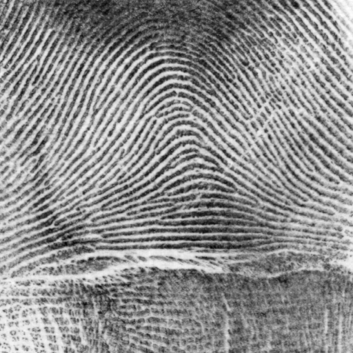
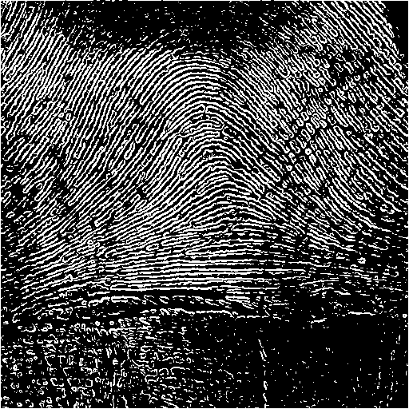

> Developed with [Giuseppe Marino](https://github.com/giuseppe16180)

## Global thresholding

This is a heuristic algorithm inspired by [Otsu's method](https://en.wikipedia.org/wiki/Otsu%27s_method). It divides the histogram in two by finding a good threshold value.

The solution is obtained iteratively. At first, we split the histogram in two using a fixed value `t`, then we find the mean on both sides, `m1` and `m2`, and finally we choose `t = (mi + m2) / 2` as a new threshold value. The algorithm keeps track of the values that have been used, and if we find one that was already used we stop.

### Usage

The implementation works on grayscale images and produces a binary image `out` (logical matrix), and the threshold value `t` that was chosen.

```matlab
[out, t] = threshold(img);
figure; imshow(out);
```

 <br> Original |  <br> Threshold
:----:|:----:

